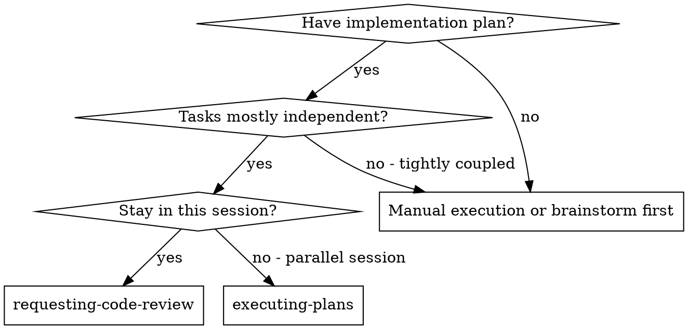
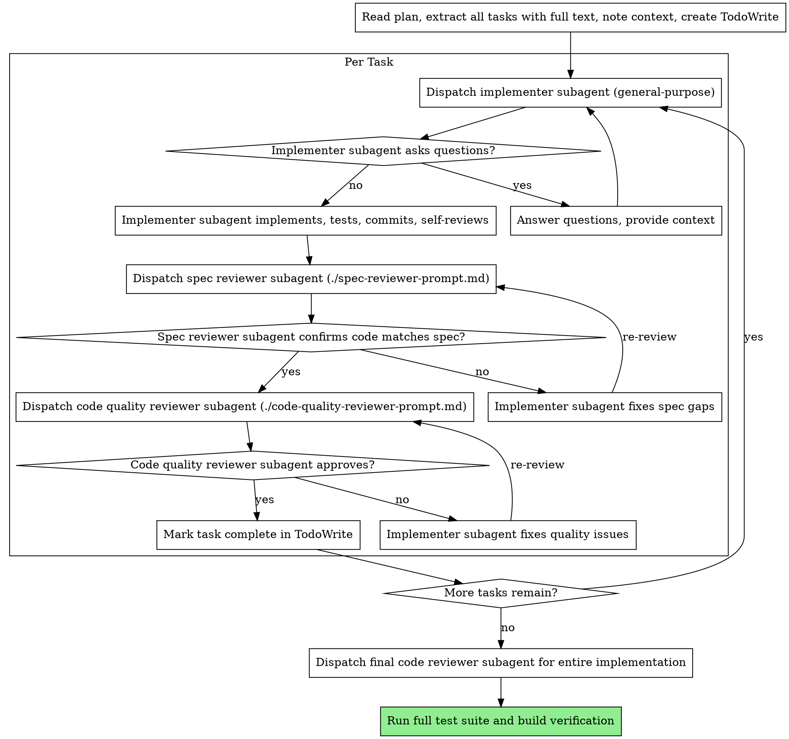

# Requesting Code Review (Subagent-Driven Development)

Execute plan by dispatching fresh subagent per task, with two-stage review after each: spec compliance review first, then code quality review.

**Core principle:** Fresh subagent per task + two-stage review (spec then quality) = high quality, fast iteration

## When to Use



**vs. Executing Plans (parallel session):**
- Same session (no context switch)
- Fresh subagent per task (no context pollution)
- Two-stage review after each task: spec compliance first, then code quality
- Faster iteration (no human-in-loop between tasks)

## The Process



## Prompt Templates & Model Selection

| Subagent | Agent Type | Model | Why |
|----------|------------|-------|-----|
| **Implementer** | `general-purpose` | (default) | Complex implementation work |
| **Spec Reviewer** | `general-purpose` | `haiku` | Simple checklist comparison |
| **Code Quality Reviewer** | `mannay-claude-code:code-reviewer` | Opus (enforced) | Deep 4-phase analysis |
| **Final Reviewer** | `mannay-claude-code:code-reviewer` | Opus (enforced) | Architectural review |

**IMPORTANT:** Code quality reviews MUST use the `mannay-claude-code:code-reviewer` agent type, which enforces Opus. Do NOT use `general-purpose` with `model: haiku` for code quality - it lacks the depth needed.

- **Implementer**: `Task(subagent_type="general-purpose", ...)`
- **Spec Reviewer**: `Task(subagent_type="general-purpose", model="haiku", ...)` - see `./spec-reviewer-prompt.md`
- **Code Quality Reviewer**: `Task(subagent_type="mannay-claude-code:code-reviewer", ...)` - see `./code-quality-reviewer-prompt.md`
- **Final Reviewer**: `Task(subagent_type="mannay-claude-code:code-reviewer", ...)`

## Example Workflow

```
You: I'm using Requesting Code Review to execute this plan.

[Read plan file once: planning/feature-plan.md]
[Extract all 5 tasks with full text and context]
[Check for existing progress files - resume if found]
[Create TodoWrite with all tasks]
[Initialize progress tracking if new]

Task 1: Authentication middleware

[Get Task 1 text and context (already extracted)]
[Dispatch implementation subagent with full task text + context]

Implementer: "Before I begin - should we use JWT or session-based auth?"

You: "Use JWT with httpOnly cookies for security"

Implementer: "Got it. Implementing now..."
[Later] Implementer:
  - Implemented auth middleware with JWT
  - Added tests, 8/8 passing (92% coverage)
  - Self-review: Found I missed refresh token logic, added it
  - Committed

[Dispatch spec compliance reviewer]
Spec reviewer: ✅ Spec compliant - all requirements met, nothing extra

[Get git SHAs, dispatch code quality reviewer]
Code reviewer: Strengths: Good test coverage, secure. Issues: None. Approved.

[Mark Task 1 complete - update progress files with commit reference]

Task 2: Protected API routes

[Get Task 2 text and context (already extracted)]
[Dispatch implementation subagent with full task text + context]

Implementer: [No questions, proceeds]
Implementer:
  - Added auth protection to API routes
  - 12/12 tests passing (95% coverage)
  - Self-review: All good
  - Committed

[Dispatch spec compliance reviewer]
Spec reviewer: ❌ Issues:
  - Missing: Rate limiting (spec says "max 100 requests/minute")
  - Extra: Added /api/admin routes (not requested)

[Implementer fixes issues]
Implementer: Removed /api/admin routes, added rate limiting middleware

[Spec reviewer reviews again]
Spec reviewer: ✅ Spec compliant now

[Dispatch code quality reviewer]
Code reviewer: Strengths: Solid. Issues (Important): Magic number (100)

[Implementer fixes]
Implementer: Extracted RATE_LIMIT_MAX constant

[Code reviewer reviews again]
Code reviewer: ✅ Approved

[Mark Task 2 complete]

...

[After all tasks]
[Dispatch final code-reviewer agent]
Final reviewer: All requirements met, ready to merge

[Run full test suite]
Run: pnpm test
Result: 45/45 passing (90% coverage)

[Run build]
Run: pnpm build
Result: ✓ Build successful

Done!
```

## Advantages

**vs. Manual execution:**
- Subagents follow TDD naturally (use mannay:test-driven-development)
- Fresh context per task (no confusion)
- Parallel-safe (subagents don't interfere)
- Subagent can ask questions (before AND during work)

**vs. Executing Plans:**
- Same session (no handoff)
- Continuous progress (no waiting)
- Review checkpoints automatic

**Efficiency gains:**
- No file reading overhead (controller provides full text)
- Controller curates exactly what context is needed
- Subagent gets complete information upfront
- Questions surfaced before work begins (not after)

**Quality gates:**
- Self-review catches issues before handoff
- Two-stage review: spec compliance, then code quality
- Review loops ensure fixes actually work
- Spec compliance prevents over/under-building
- Code quality ensures implementation is well-built
- Mannay agents provide specialized quality checks:
  - security-engineer for auth/validation
  - accessibility-specialist for WCAG compliance
  - performance-engineer for optimization
  - code-reviewer for comprehensive analysis

**Cost:**
- More subagent invocations (implementer + 2 reviewers per task)
- Controller does more prep work (extracting all tasks upfront)
- Review loops add iterations
- But catches issues early (cheaper than debugging later)

## Red Flags

**Never:**
- Skip reviews (spec compliance OR code quality)
- Proceed with unfixed issues
- Dispatch multiple implementation subagents in parallel (conflicts)
- Make subagent read plan file (provide full text instead)
- Skip scene-setting context (subagent needs to understand where task fits)
- Ignore subagent questions (answer before letting them proceed)
- Accept "close enough" on spec compliance (spec reviewer found issues = not done)
- Skip review loops (reviewer found issues = implementer fixes = review again)
- Let implementer self-review replace actual review (both are needed)
- **Start code quality review before spec compliance is ✅** (wrong order)
- Move to next task while either review has open issues
- Use npm instead of pnpm

**If subagent asks questions:**
- Answer clearly and completely
- Provide additional context if needed
- Don't rush them into implementation

**If reviewer finds issues:**
- Implementer (same subagent) fixes them
- Reviewer reviews again
- Repeat until approved
- Don't skip the re-review

**If subagent fails task:**
- Dispatch fix subagent with specific instructions
- Don't try to fix manually (context pollution)

## Progress Tracking & Crash Recovery

**Update progress after each task:**
```javascript
import { updateTaskStatus, appendLog } from 'memory/progress/index.js';
import { markTaskComplete } from 'memory/progress/updater.js';

// After task implementation and reviews pass
const commitHash = getLatestCommitHash();
markTaskComplete(planFile, taskId, commitHash);
updateTaskStatus(planFile, taskId, 'completed', { commit: commitHash });
appendLog(planFile, `Task ${taskId} completed (commit: ${commitHash})`);
```

**If session crashes:**
1. Progress preserved in `<plan>-progress.json` and `<plan>-progress.md`
2. Plan file has ✅ markers on completed tasks
3. New session resumes from first incomplete task
4. Git log shows all committed work

**On session start, check for existing progress:**
```javascript
import { hasProgress, getProgress } from 'memory/progress/index.js';

if (hasProgress(planFile)) {
  const progress = getProgress(planFile);
  const nextTask = progress.tasks.find(t => t.status !== 'completed');
  console.log(`Resuming from Task ${nextTask.id}`);
}
```

## Integration

**Required workflow skills:**
- **mannay:writing-plans** - Creates the plan this skill executes
- **mannay:test-driven-development** - Subagents follow TDD for each task

**Subagents can use:**
- **mannay:systematic-debugging** - For debugging failures

**Mannay agents for quality:**
- **code-reviewer** - Comprehensive code quality analysis
- **security-engineer** - Security vulnerabilities and OWASP compliance
- **accessibility-specialist** - WCAG compliance and inclusive design
- **performance-engineer** - Performance optimization and bottlenecks

**Alternative workflow:**
- **mannay:executing-plans** - Use for parallel session instead of same-session execution
